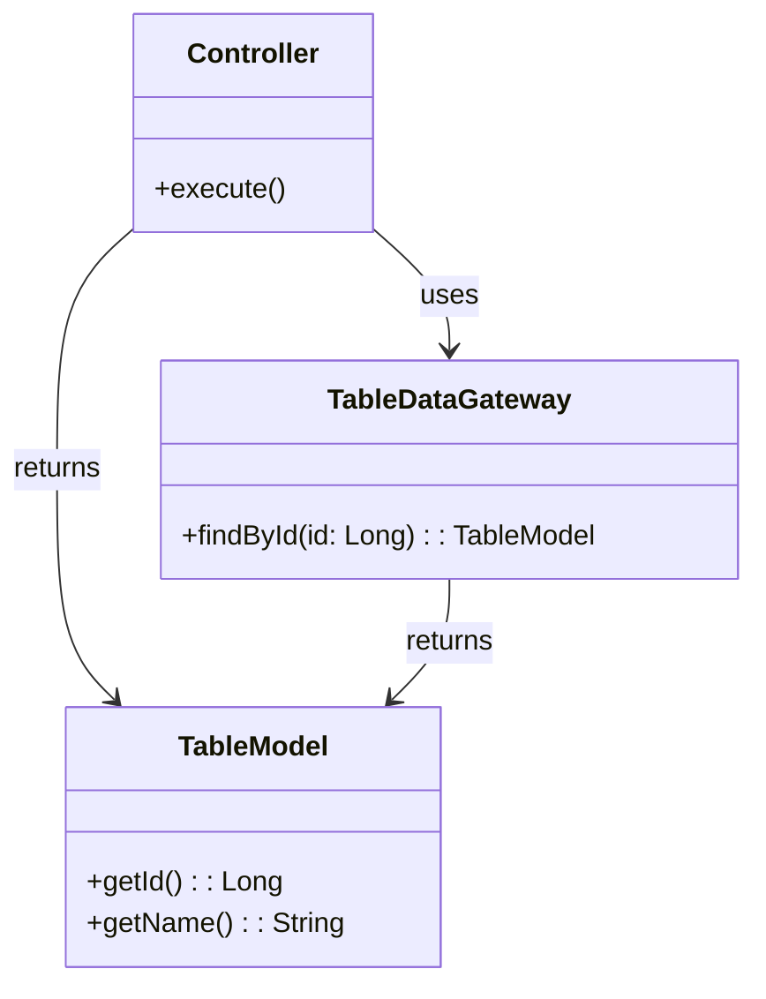
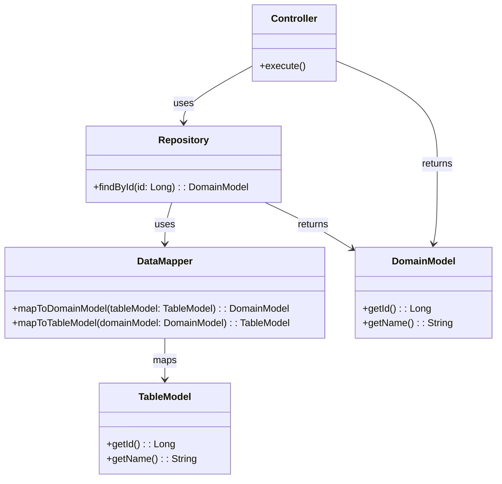
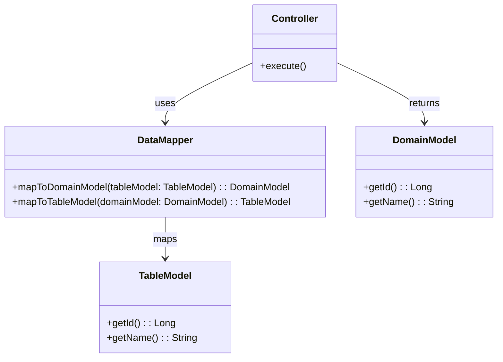

# PofEAA REIWA版

Martin Fowlerの「Patterns of Enterprise Application Architecture」（PofEAA）のパターンを、現代の開発手法に合わせて更新したモダンなJava実装です。

## 概要

このプロジェクトは、モダンなJavaの機能と現在のベストプラクティスを使用して、エンタープライズアプリケーションパターンのリファレンス実装を提供します。学習リソースとしても、今日のアプリケーションでこれらの時代を超越したパターンを実装するための実用的なガイドとしても役立ちます。

## パターン

### ドメインロジックパターン

- **Transaction Script（トランザクションスクリプト）**: 各操作を単一のプロシージャまたはメソッドとして実装する手続き型アプローチ。
- **Table Module（テーブルモジュール）**: データベース内の単一のテーブルを中心にドメインロジックを組織化し、そのテーブルでの操作をカプセル化するパターン。
- **Domain Model（ドメインモデル）**: ビジネスロジックをビジネスの概念を表すドメインオブジェクトにカプセル化するオブジェクト指向アプローチ。

### データソースアーキテクチャパターン

- **Table Data Gateway（テーブルデータゲートウェイ）**: データベース内の単一のテーブルへのインターフェースを提供し、CRUD操作を可能にするゲートウェイ。
- **Row Data Gateway（行データゲートウェイ）**: テーブルデータゲートウェイと類似しているが、テーブル内の単一の行で動作する。
- **Active Record（アクティブレコード）**: データベーステーブルまたはビューの行をラップし、データベースアクセスとビジネスロジックをカプセル化するオブジェクト。
- **Data Mapper（データマッパー）**: ドメインモデルとデータベース間をマッピングする層で、関心の分離を可能にする。

### オブジェクト関係行動パターン

- **Unit of Work（作業単位）**: ビジネストランザクションで影響を受けるオブジェクトのリストを保持し、変更の書き出しを調整するパターン。
- **Identity Map（アイデンティティマップ）**: 各オブジェクトがセッション当たり1回だけロードされることを保証し、オブジェクトと識別子のマップを維持するパターン。
- **Lazy Load（レイジーロード）**: 実際に必要になるまでオブジェクトのロードを遅延させ、不要なデータベースクエリを避けることでパフォーマンスを改善するパターン。

### オブジェクト関係構造パターン

- **Identity Field（アイデンティティフィールド）**: オブジェクト内のフィールドを使用してオブジェクトのアイデンティティを表現するパターン。通常はデータベースの主キー。
- **Foreign Key Mapping（外部キーマッピング）**: データベース内の外部キーを使用してオブジェクト間の関係をマッピングするパターン。
- **Association Table Mapping（関連テーブルマッピング）**: オブジェクト間の多対多の関係を表現するために別のテーブルを使用するパターン。
- **Dependent Mapping（依存マッピング）**: オブジェクトが別のオブジェクトに依存することを可能にするパターン。通常は1対1の関係で使用される。

### オブジェクト関係メタデータマッピングパターン

- **Metadata Mapping（メタデータマッピング）**: メタデータを使用してドメインオブジェクトとデータベーステーブル間のマッピングを定義し、柔軟で動的なマッピングを可能にするパターン。
- **Query Object（クエリオブジェクト）**: クエリをオブジェクトにカプセル化し、ドメインモデルにクエリロジックを密結合することなく複雑なクエリを構築・実行できるパターン。
- **Repository（リポジトリ）**: ドメインオブジェクトにアクセスするためのコレクションライクなインターフェースを提供し、基盤となるデータソースを抽象化するパターン。

### Webプレゼンテーションパターン

時代遅れ。

### 分散パターン

- **Remote Facade（リモートファサード）**: リモートクライアント向けに簡素化されたインターフェースを提供し、リモートコールの数を削減してパフォーマンスを改善するパターン。
- **Data Transfer Object (DTO)（データ転送オブジェクト）**: プロセス間でデータを転送するパターン。通常、データを単一のオブジェクトに集約することでリモートコール数を削減するために使用される。

### オフライン一貫性パターン

### セッション状態パターン

時代遅れ。

### 基本パターン

- **Gateway（ゲートウェイ）**: 複雑なサブシステムへのシンプルなインターフェースを提供し、サブシステムとの相互作用を容易にするパターン。
- **Mapper（マッパー）**: 異なる表現間でデータを変換するパターン。通常、ドメインオブジェクトとデータベーステーブル間のマッピングに使用される。
- **Separated Interface（分離インターフェース）**: クラスのインターフェースを実装から分離し、より柔軟で保守性の高いコードを可能にするパターン。
- **Registry（レジストリ）**: オブジェクトを登録・取得するための中央の場所を提供し、通常は依存関係と設定の管理に使用されるパターン。
- **Value Object（値オブジェクト）**: ドメインの記述的側面を表すパターン。通常は不変でアイデンティティを持たず、属性と動作をカプセル化するために使用される。
- **Money（通貨）**: 金額を表す特殊な値オブジェクト。通貨と値をカプセル化し、金融操作の正しい処理を保証する。
- **Special Case（特殊ケース）**: 一般的なケースとは異なる方法で特定のケースや例外を処理するパターン。しばしばエッジケースに対してカスタム動作を提供するために使用される。
- **Plugin（プラグイン）**: 既存のコードベースを変更することなく新しい機能や動作を追加してアプリケーションの機能を拡張することを可能にし、モジュール性と柔軟性を促進するパターン。
- **Service Stub（サービススタブ）**: サービスのためのシンプルなインターフェースを提供し、内部の複雑さを公開することなくサービスとの簡単な相互作用を可能にするパターン。

## 組み合わせ

PofEAAのパターンを注意深く読むと、ドメインロジックパターンとデータソースパターンの組み合わせは以下の3つのパターンに集約できます。

### Transaction Script

モデルを作成しても、それはRDBテーブルの不変条件を満たしますが、必ずしもビジネスの不変条件と同じではありません。

### Domain Model with Repository

### Domain Model with Data Mapper

## 参考文献

- [Patterns of Enterprise Application Architecture](https://martinfowler.com/books/eaa.html) by Martin Fowler
- [Enterprise Integration Patterns](https://www.enterpriseintegrationpatterns.com/)
- [Domain-Driven Design](https://www.domainlanguage.com/ddd/) by Eric Evans

## ライセンス

このプロジェクトはMITライセンスの下でライセンスされています。詳細はLICENSEファイルを参照してください。