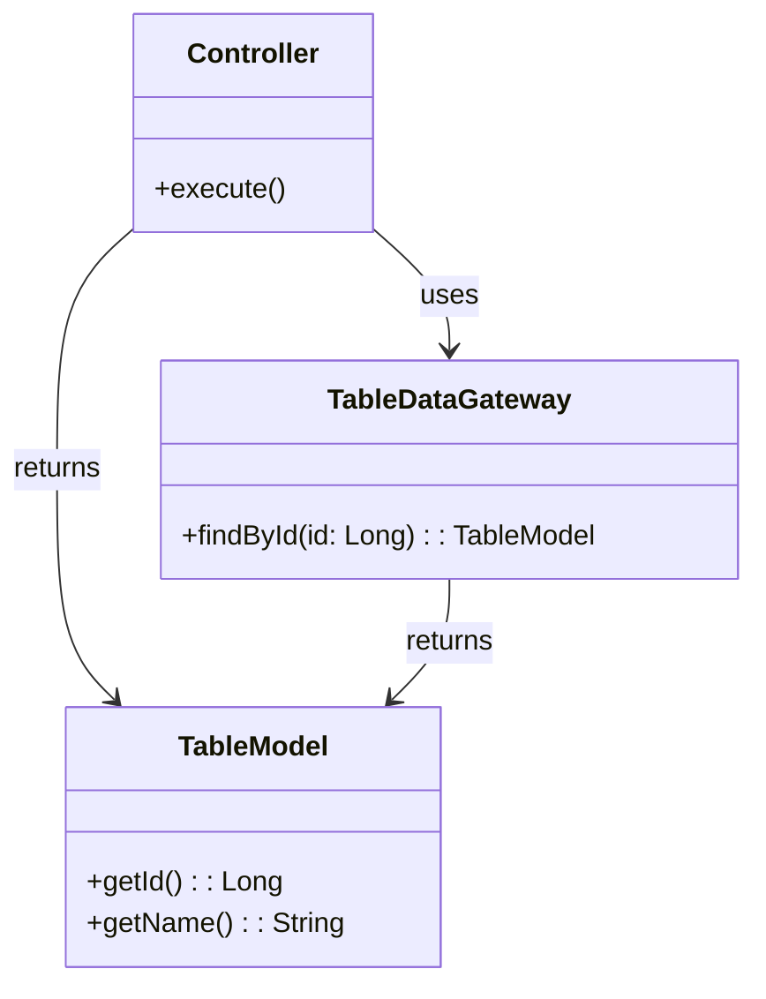
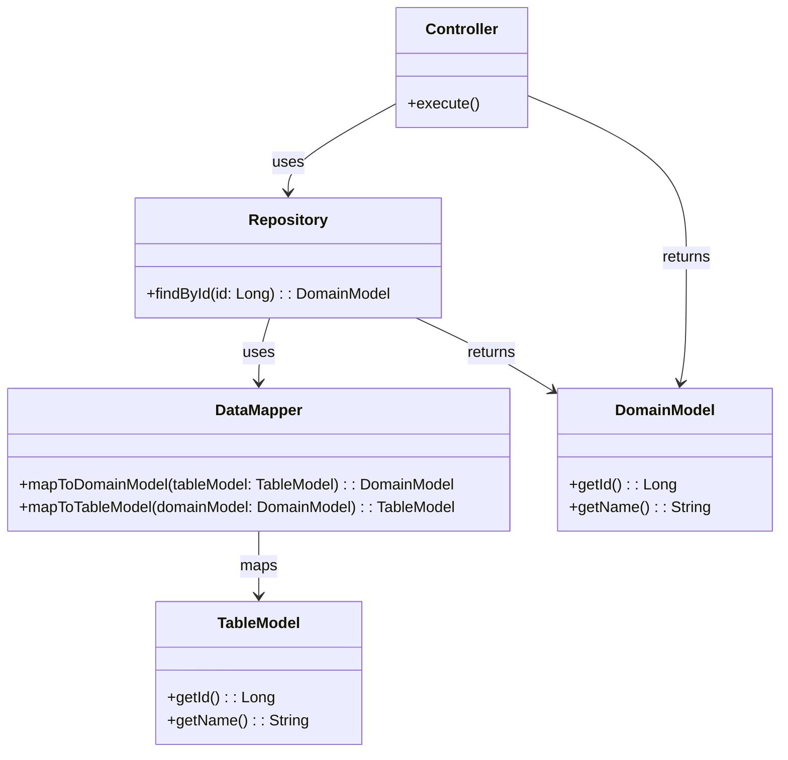
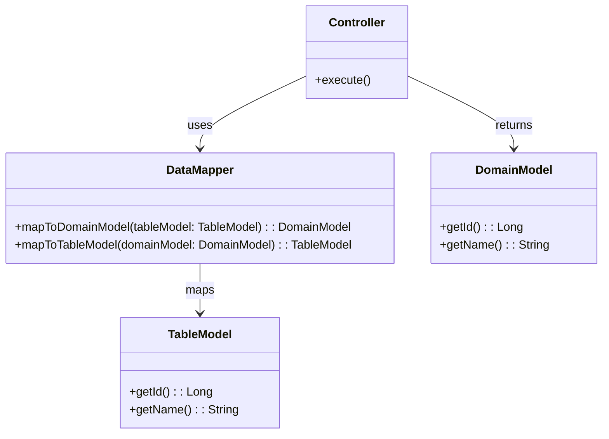

# PofEAA REIWA edition

A modern Java implementation of the patterns from Martin Fowler's "Patterns of Enterprise Application Architecture" (PofEAA), updated for contemporary development practices.

## Overview

This project provides reference implementations of enterprise application patterns using modern Java features and current best practices. It serves as both a learning resource and a practical guide for implementing these timeless patterns in today's applications.

## Patterns

### Domain Logic Patterns

- **Transaction Script**: A procedural approach where each operation is implemented as a single procedure or method.
- **Table Module**: A pattern that organizes domain logic around a single table in the database, encapsulating operations on that table.
- **Domain Model**: An object-oriented approach where the business logic is encapsulated in domain objects that represent the concepts of the business.

### Data Source Architectural Patterns

- **Table Data Gateway**: A gateway that provides an interface to a single table in the database, allowing for CRUD operations.
- **Row Data Gateway**: Similar to Table Data Gateway, but operates on a single row in a table.
- **Active Record**: An object that wraps a row in a database table or view, encapsulating the database access and business logic.
- **Data Mapper**: A layer that maps between the domain model and the database, allowing for a clean separation of concerns.

### Object-Relational Behavioral Patterns

- **Unit of Work**: A pattern that maintains a list of objects affected by a business transaction and coordinates the writing out of changes.
- **Identity Map**: A pattern that ensures each object is loaded only once per session, maintaining a map of objects to their identifiers.
- **Lazy Load**: A pattern that defers the loading of an object until it is actually needed, improving performance by avoiding unnecessary database queries.

### Object-Relational Structural Patterns

- **Identity Field**: A pattern that uses a field in the object to represent the identity of the object, typically a primary key in the database.
- **Foreign Key Mapping**: A pattern that maps relationships between objects using foreign keys in the database.
- **Association Table Mapping**: A pattern that uses a separate table to represent many-to-many relationships between objects.
- **Dependent Mapping**: A pattern that allows an object to be dependent on another object, typically used for one-to-one relationships.

### Object-Relational Metadata Mapping Patterns

- **Metadata Mapping**: A pattern that uses metadata to define the mapping between domain objects and database tables, allowing for flexible and dynamic mappings.
- **Query Object**: A pattern that encapsulates a query in an object, allowing for complex queries to be constructed and executed without tightly coupling the query logic to the domain model.
- **Repository**: A pattern that provides a collection-like interface for accessing domain objects, abstracting the underlying data source.

### Web Presentation Patterns

Outdated.

### Distributed Patterns

- **Remote Facade**: A pattern that provides a simplified interface for remote clients, reducing the number of remote calls and improving performance.
- **Data Transfer Object (DTO)**: A pattern that transfers data between processes, typically used to reduce the number of remote calls by aggregating data into a single object.

### Offline Consistency Patterns

### Session State Patterns

Outdated.

### Base Patterns

- **Gateway**: A pattern that provides a simple interface to a complex subsystem, allowing for easier interaction with the subsystem.
- **Mapper**: A pattern that converts data between different representations, typically used to map between domain objects and database tables.
- **Separated Interface**: A pattern that separates the interface of a class from its implementation, allowing for more flexible and maintainable code.
- **Registry**: A pattern that provides a central place to register and retrieve objects, typically used for managing dependencies and configurations.
- **Value Object**: A pattern that represents a descriptive aspect of the domain, typically immutable and without identity, used to encapsulate attributes and behaviors.
- **Money**: A specialized value object that represents a monetary amount, encapsulating currency and value, ensuring correct handling of financial operations.
- **Special Case**: A pattern that handles specific cases or exceptions in a way that is distinct from the general case, often used to provide custom behavior for edge cases.
- **Plugin**: A pattern that allows for extending the functionality of an application by adding new features or behaviors without modifying the existing codebase, promoting modularity and flexibility.
- **Service Stub**: A pattern that provides a simple interface for a service, allowing for easy interaction with the service without exposing its internal complexities.

## Combination

When reading the patterns in PoEAA carefully, the combinations of Domain Logic patterns and Data Source patterns can be consolidated into the following 3 patterns.

### Transaction Script

Even if we create a model, it satisfies the invariants of RDB tables, but these are not necessarily identical to the business invariant conditions.

### Domain Model with Repository

### Domain Model with Data Mapper

## References

- [Patterns of Enterprise Application Architecture](https://martinfowler.com/books/eaa.html) by Martin Fowler
- [Enterprise Integration Patterns](https://www.enterpriseintegrationpatterns.com/)
- [Domain-Driven Design](https://www.domainlanguage.com/ddd/) by Eric Evans

## License

This project is licensed under the MIT License - see the LICENSE file for details.
