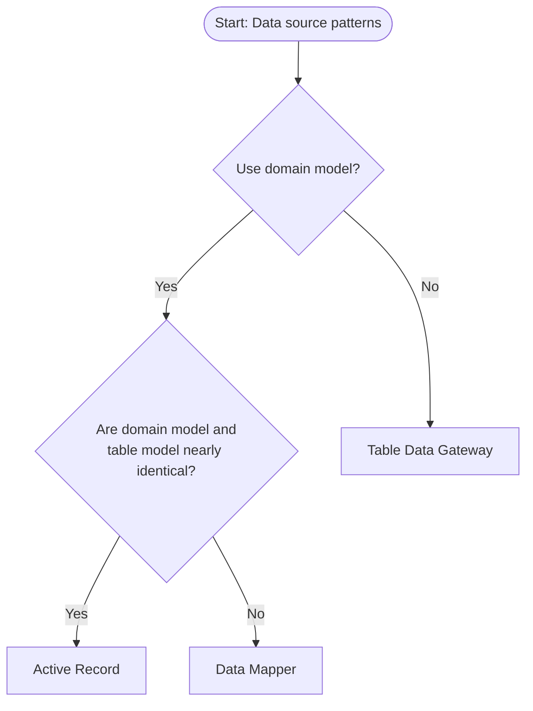

# Data Source Architectural Patterns Decision Chart

At first, you need to difference it between domain model and table model.
Domain model represents the business invariants, while table model represents the database table structure.
If your design fails to capture the business invariants, then no matter how type-safe the mechanism is, it is still just a table model.

## Pattern Selection Decision Flow

